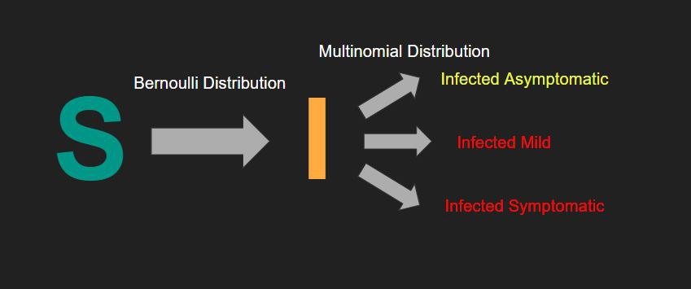

Forked from Prob Stats COVID project

<h1>About</h1>
The spread of COVID19 has illuminated the need for a better understanding
of disease spread mechanics and the impact of non-pharmaceutical interventions. 
Using county level data from the state of New York, our group was able to 
develop a simple model for illustrating the spread of COVID19 is simulated 
communities. 

<h1>How It Works</h1>
R0 values were determined for rural, suburban, and urban areas by using least
squares linear regression. The R0 values dictate the rate of transition in SIR models from S to I, where S is susceptible, I is infected, and R is recovered/removed from the population. After determining those values, they were converted into parameters for a stochastic model using Bernoulli random variables to simulate the transition from S to I. The recovered/removed population was ignored in this model because there is still little consensus on how long infected individuals remain infectious after recovering. After determining the number of infected individuals in the simulation, the infected population is further split up into three categories, asymptomatic, mild symptomatic, and severe symptomatic. The individuals in the simulation are assigned a random age, and the younger the age, the more likely that individual is to be asymptomatic or mild symptomatic.

<h1>Programs and Scripts</h1>
launchModel.m: Ideally the only function that is interacted with at the end
of the day when it comes to controlling sirModel.m and sirODE.m.

sirModel.m: Sets up and passes in the initial conditions necessary for
sirODE.m to fulfill its job. Arguments are susceptible % of population, 
infected %, recovered %, time duration for simulation, R0 (how many people
an infected person infects), and recovery rate. Called from launchModel.m.

sirODE.m: Uses ode45 (nonstiff, medium accuracy) to integrate the three 
differential equations responsible that are part of the SIR model. This 
function should never be called by itself and is only called through 
sirModel.m

sirVisualClassDef.m: Should not be called directly. But for reference, this 
code creates an object of type sirVisualClassDef and runs the model. Follows 
the format of obj = sirVisualClassDef(N,KE,SD,SDT,T). N is the number of people in
simulation environment. Make sure it's a square number like 64 or 100. Don't 
worry about KE for now, just keep it to a number between 0.5 and 2 and you 
should be fine. Think of it as an interaction parameter between people in the
simulation environment. Specific instructions are in visualScript.m file. SD
is whether social distancing is present starting day 1, so 1 is true and 0 
false. SDT is social distancing threshold, so you can specify a specific
percentage of the population you want infected before social distancing kicks
in. T is a logical for whether testing is present in your simulation, so 1
for true and 0 for false. If you named your object obj, the next thing you do to see
the animation is to input draw(obj) into the command window. There is also
a function called drawInfected, so you can call drawInfected(obj), and you 
will just see a graph of the infected people grow over time. 

visualScript.m: Contains all the instructions for running sirVisualClassDef.m,
this is the place to call the simulation object. 
